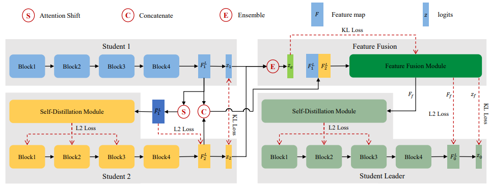

## Distilling Powerful Student Model via Online Knowledge Distillation  

<div align=center></div>

The framework of our proposed FFSD for online knowledge distillation. First, student 1 and student 2 learn from each other in a collaborative way. Then by shifting the attention of student 1 and distilling it to student 2, we are able to enhance the diversity among students. Last, the feature fusion module fuses all the students’ information into a fused feature map. The fused representation is then used to assist the learning of the student leader. After training, we simply adopt the student leader which achieves superior performance over all other students.

### Getting Started

The code has been tested using Pytorch1.5.1 and CUDA10.2 on Ubuntu 18.04.

Please type the command 

```shell
pip install -r requirements.txt
```

to install dependencies.

### FFSD

- You can run the following code to train models on CIFAR-100:

  ```shell
  python cifar.py
  	--dataroot ./database/cifar100
  	--dataset cifar100
  	--model resnet32
  	--lambda_diversity 1e-5
  	--lambda_self_distillation 1000
  	--lambda_fusion 10
  	--gpu_ids 0
  	--name cifar100_resnet32_div1e-5_sd1000_fusion10
  ```

- You can run the following code to train models on ImageNet:

  ```shell
  python distribute_imagenet.py
  	--dataroot ./database/imagenet
  	--dataset imagenet
  	--model resnet18
  	--lambda_diversity 1e-5
  	--lambda_self_distillation 1000
  	--lambda_fusion 10
  	--gpu_ids 0,1
  	--name imagenet_resnet18_div1e-5_sd1000_fusion10
  ```

  

### Experimental Results

We provide the student leader models in the experiments, along with their training loggers and configurations.

|   Model   |  Dataset  | Top1 Accuracy (%) |                           Download                           |
| :-------: | :-------: | :---------------: | :----------------------------------------------------------: |
| ResNet20  | CIFAR-100 |       72.64       | [Link](https://drive.google.com/drive/folders/1s6HCEd1dfQkvTdgA1ObNIvk0dGPCWOeF?usp=sharing) |
| ResNet20  | CIFAR-100 |       72.58       | [Link](https://drive.google.com/drive/folders/1eKeeUzufJS8TA4EWLNhaXaufHIVTpBud?usp=sharing) |
| ResNet20  | CIFAR-100 |       72.88       | [Link](https://drive.google.com/drive/folders/1wpCcp9UQw3UBT1SYF_9H5Obgj4Q76f-U?usp=sharing) |
| ResNet32  | CIFAR-100 |       74.92       | [Link](https://drive.google.com/drive/folders/1vg6Ph8MtR2GRKoVFVz6h9y-rtTn52pC1?usp=sharing) |
| ResNet32  | CIFAR-100 |       74.82       | [Link](https://drive.google.com/drive/folders/1G8jPej1B4_qrm8tpwZo3MeEOdM17gULz?usp=sharing) |
| ResNet32  | CIFAR-100 |       74.82       | [Link](https://drive.google.com/drive/folders/1T37H_V1mc_-NqmV2NoL09f1BpEQ2MCtp?usp=sharing) |
| ResNet56  | CIFAR-100 |       75.84       | [Link](https://drive.google.com/drive/folders/1L2KDKTqfgW3vkmgUNrlyWiKTA0XY8z1w?usp=sharing) |
| ResNet56  | CIFAR-100 |       75.66       | [Link](https://drive.google.com/drive/folders/18CqXc667xNv27LWJEf3ozRVSMpV65dn6?usp=sharing) |
| ResNet56  | CIFAR-100 |       75.91       | [Link](https://drive.google.com/drive/folders/1DATv0qyP1X2qYNMfHZ-fF2bVZzXuEJMb?usp=sharing) |
| WRN-16-2  | CIFAR-100 |       75.87       | [Link](https://drive.google.com/drive/folders/16StA7XUG0VBVCzVjs3OEaJiNyOSbgNPu?usp=sharing) |
| WRN-16-2  | CIFAR-100 |       75.86       | [Link](https://drive.google.com/drive/folders/18Jtxg1wX92yFLDAfidyDKvco2_IhCJnB?usp=sharing) |
| WRN-16-2  | CIFAR-100 |       75.69       | [Link](https://drive.google.com/drive/folders/1aFhFC4UZxBCy5N1b1fhSClxGNUUqqqQ8?usp=sharing) |
| WRN-40-2  | CIFAR-100 |       79.13       | [Link](https://drive.google.com/drive/folders/1L7obno--Zht7z6iHPaZG40I3Q4Zu1Dnz?usp=sharing) |
| WRN-40-2  | CIFAR-100 |       79.19       | [Link](https://drive.google.com/drive/folders/1tbOPksWO-oU0cn4XC1SuBvzgsJR8T7-i?usp=sharing) |
| WRN-40-2  | CIFAR-100 |       79.11       | [Link](https://drive.google.com/drive/folders/1OT1Hcpm6WhFmOBupTYSt5KMTSi9d0qYg?usp=sharing) |
| DenseNet  | CIFAR-100 |       77.29       | [Link](https://drive.google.com/drive/folders/1ToE3eaZvUX20CxXius4MriLD4I22pkxq?usp=sharing) |
| DenseNet  | CIFAR-100 |       77.70       | [Link](https://drive.google.com/drive/folders/11eG8TsQA0H1ugNO0I2vadzifA-dbP3Qj?usp=sharing) |
| DenseNet  | CIFAR-100 |       77.17       | [Link](https://drive.google.com/drive/folders/1a0Ji8Q4Ff6-1FZN7dNPTR3J1qSB46CzD?usp=sharing) |
| GoogLeNet | CIFAR-100 |       81.52       | [Link](https://drive.google.com/drive/folders/1w_YnXnYc8sxk4eCsPHXJggCP0dqh_5Zh?usp=sharing) |
| GoogLeNet | CIFAR-100 |       81.93       | [Link](https://drive.google.com/drive/folders/1TuAV5gxFaqTqav6JaiLGgC7CCw599K4p?usp=sharing) |
| GoogLeNet | CIFAR-100 |       81.34       | [Link](https://drive.google.com/drive/folders/1KO_lwgMVWJldF-JfGQsWZiNv4Jxa2Lp9?usp=sharing) |
| ResNet-18 | ImageNet  |       70.87       | [Link](https://drive.google.com/drive/folders/1SqPrjziKZd1gMvF0Kq55Nf6r_DPoJIkx?usp=sharing) |
| ResNet-34 | ImageNet  |       74.69       | [Link](https://drive.google.com/drive/folders/1CGxlkrVuMm0JBKg5Lxg5befagP2cN1Ys?usp=sharing) |

You can use the following code to test our models.

```shell
python test.py
	--dataroot ./database/cifar100
	--dataset cifar100
	--model resnet32
	--gpu_ids 0
	--load_path ./resnet32/cifar100_resnet32_div1e-5_sd1000_fusion10_1/modelleader_best.pth
```
